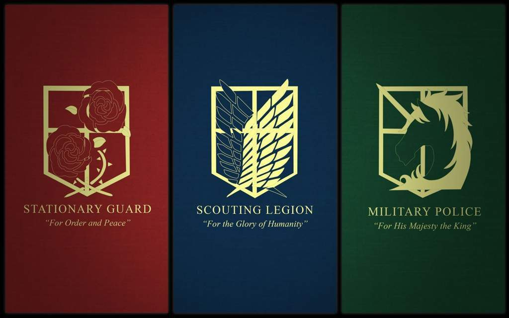

Hi there! Welcome back to another anaylsis of attack on titan. Previously, I analyzed the most and least favored characters in the show, as well as the rating for the show. Those are the basics. Again, if you don't know, this dataset was generated by ChatGPT. Thanks, Chat, for helping with my portfolio. 

First, let's load the data.
```{r load}
library(readr)
library(tidyverse)
library(forcats)
data <- read_csv("aot_fan_dataset_v2.csv")
```

First, spoilers here in this portfolio piece! Read with caution!


In this show, human fight against the titans because the titans attack the humans for no reason. Humans have lived in fear forever, and built very tall and thick walls to protect themselves. Naturally, humans organized troops and armies to defend. There are three factions in the army, scouting legion, stationary guard, and military police. Scouting legion is responsible for exploring the outside of the wall. Humans know so little about titans that they need to send these survey corps out there to learn about titans. Outside of the wall, it's easy for them to encounter titan and they would need to engage in battles. Stationary guard is responsible for taking care of the walls, and maintaining order inside the walls. The walls need to be solidified and repaired constantly. Stationary guard will also need to fight when titans are at the wall. Military police are the ones protecting the safety of the Queen. That said, they live within the most inner wall. FYI, there are three walls, the most inner wall is the safest place for human to live in, and seldom engage in fighting with the titan. 



Humans join the army and get the practice they needed. After that, they will decide which faction they would like to join. Joining the scouting legion takes the most courage and needs good fighting skills; you could die easily on this job. Joining the stationary guard is, I guess, the best option because you get to do some actual protecting job, while also keep your own safety. Joining the military police is the easiest choice. You are protected, and don't need to go on battlefields at all. Most audience despise military police. Most characters do, too; but these people are just very realistic. I won't be any better than them if I were to make this choice. 

That's a lot of information! Thanks for reading it, but if you didn't get to read all that, it's fine. Just understand statistically what I am doing is also fine!

I am beyond intrigued by what faction the audience would like to join. I want to join the scouting legion! I realize that the names are different in my dataset, so I need to mutate that. 
```{r faction}
data <- data %>%
  mutate(join_faction = recode(join_faction, "Garrison" = "Stationary Guard", "Survey Corps" = "Scouting Legion"))
faction_n <- data %>% 
  count(join_faction)
ggplot(faction_n, aes(x = "", y = n, fill = join_faction)) + geom_col(color = "white") +
  coord_polar("y") + 
  labs(title = "Which faction do people want to join?",
       x = NULL,
       y = NULL,
       fill = "Faction") + 
   geom_text(
    aes(label = n),
    position = position_stack(vjust = 0.5)
  ) +
  theme_minimal()
```

This is what I expected. I think most audience would want to be survey corps. 

I am interested in the participants' personality and how that might be associated with what they want to become. 
```{r person_facti}
table(data$join_faction, data$personality)
chisq.test(table(data$join_faction, data$personality))
ggplot(data = data, aes(x = join_faction, fill = personality)) +
  geom_bar(position = "fill") +
  scale_y_continuous(labels = scales::percent) +
  labs(
    y = "Proportion",
    x = "Faction",
    fill = "Personality",
    title = "Personality and Faction"
  ) +
  theme_minimal()
```

Given the chi-square result, there is not enough evidence to conclude a significant association between the faction people want to join and their personality. There ain't much difference in the distribution of personality within each faction. 

There are 9 major titans in the show. I would like to exlore next which titan people want to become.
```{r titan}
data %>% 
  count(want_to_be_titan) %>% 
  arrange(desc(n))
ggplot(data, aes(x = want_to_be_titan, color = want_to_be_titan)) +
  labs(
    x = NULL,
    title = "Frequency of want to be titan"
  ) +
  geom_bar() +
  theme(axis.text.x = element_blank(),
      axis.ticks.x = element_blank())
```


Is there a relationship between want to be titan and personality?
```{r pers_titan}
table(data$want_to_be_titan, data$personality)
chisq.test(table(data$want_to_be_titan, data$personality))
```

No, there isn't a relationship between them. 

What about relationship between want to be titan and favorite character?
```{r favcha_titan}
chisq.test(table(data$want_to_be_titan, data$fav_character))
```

Hmmm... This data is confirmed to be randomly generated by Chat. There is no relationship between the categorical variables. 

I hope to one day collect real data on these questions!