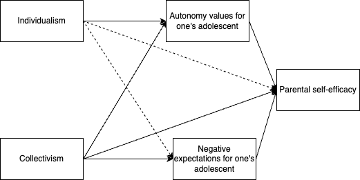

In this portfolio, I will be exploring the data for my thesis project. I am hoping to conduct path analysis. I used bootstrap 1000 where it should be 10,000. However, 10,000 takes way too much time, so please bear with me. 

Let's load the libraries and the data file.
```{r load, message = FALSE}
library(haven)
library(lavaan)
library(tidyverse)
library(semPlot)
library(car)
library(sjPlot)
SYP <- read_sav("composite204 4 copy.sav")
```

In my thesis, I was exploring the relationship between parental self-efficacy and cultural differences. It was found that PSE was significantly higher in parents from collectivistic cultures than parents from individualistic cultures during adolescence (Buchanan et al., 2024). In my study, I tried to explore the reason why this might be the case. This dataset was collected in 2025 by me. Let's dive right in!

I hypothesized that the relationship between parents' cultural orientation (i.e., individualism and collectivism) and parental self-efficacy is mediated by parents' expectations, autonomy and relatedness values for adolescents, and social support for parenting. So, I put two IVs, four mediators, and parental self-efficacy as the DV to run a path analysis. 

```{r model1}
set.seed(123)
model1 <- '
PSE_FD ~ c1*IND + c2*COL + b1*RASH_A + b2*RASH_R + b3*SocSup + b4*SSv2
RASH_A ~ a1*IND + a2*COL
RASH_R ~ a3*IND + a4*COL
SocSup ~ a5*IND + a6*COL
SSv2 ~ a7*IND + a8*COL

#Rash A mediate IND and PSE
ind1 := a1 * b1

#Rash R mediate IND and PSE
ind2 := a3 * b2

#Socialsupport mediate IND and PSE
ind3 := a5 * b3

#Expectations mediate IND and PSE
ind4 := a7 * b4

#Rash A mediate COL and PSE
ind5 := a2 * b1

#Rash R mediate COL and PSE
ind6 := a4 * b2

#Social support mediate COL and PSE
ind7 := a6 * b3

#Expectations mediate COL and PSE
ind8 := a8 * b4

'

fit1 <- sem(model1, data = SYP, se = "bootstrap", bootstrap = 1000)
summary(fit1, standardized = TRUE, fit.measures = TRUE, rsquare = TRUE)
```

To determine whether what I proposed is indeed true, we should look at the model fit.     
We can see that it is really a poor fit. CFI = .876, TLI = .586, RMSEA = .177, SRMR = .072. So, Let's see if there is anything we can modify for the model. 

```{r modify1}
modindices(fit1, sort = TRUE, minimum.value = 10)
```

I would not add any regression path to my model because it will go against my theoretical background. However, the two covariation paths could be added. 

Given this advice, let's improve our model. 
```{r model2}
set.seed(123)
model2 <- '
PSE_FD ~ c1*IND + c2*COL + b1*RASH_A + b2*RASH_R + b3*SocSup + b4*SSv2
RASH_A ~ a1*IND + a2*COL
RASH_R ~ a3*IND + a4*COL
SocSup ~ a5*IND + a6*COL
SSv2 ~ a7*IND + a8*COL

#Rash A mediate IND and PSE
ind1 := a1 * b1

#Rash R mediate IND and PSE
ind2 := a3 * b2

#Socialsupport mediate IND and PSE
ind3 := a5 * b3

#Expectations mediate IND and PSE
ind4 := a7 * b4

#Rash A mediate COL and PSE
ind5 := a2 * b1

#Rash R mediate COL and PSE
ind6 := a4 * b2

#Social support mediate COL and PSE
ind7 := a6 * b3

#Expectations mediate COL and PSE
ind8 := a8 * b4

#adding covariation
RASH_R ~~ SocSup
SocSup ~~ SSv2
'

fit2 <- sem(model2, data = SYP, se = "bootstrap", bootstrap = 1000)
summary(fit2, standardized = TRUE, fit.measures = TRUE, rsquare = TRUE)
```

This time, it still shows poor model fit: CFI = .963, TLI = .815, RMSEA = .118, SRMR = .042. It definitely improved from the last model, but still needs improvement.

It could be the case that the model has quite a few insignificant pathways that sabotaged model fit. So, I would like to examine the relationship between these four mediators and the DV using a multiple regression.
```{r multiple regression}
model21 <- lm(data = SYP,  PSE_FD ~ RASH_A + RASH_R + SocSup + SSv2)
summary(model21)
```

When putting all four variables in the same model, only autonomy values for adolescents and expectations for adolescents were significantly associated with PSE. To help improve the model fit for the mediation model, it might be helpful to take out the other two that were not significant in associating with PSE when holding other variables constant. 

Thus, model 3 includes two IVs (i.e., individualism and collectivism), two mediators (autonomy values and expectations for adolescents) and a DV (i.e., PSE).
```{r model3}
set.seed(123)
model3 <- '
PSE_FD ~ c1*IND + c2*COL + b1*RASH_A + b2*SSv2
RASH_A ~ a1*IND + a2*COL
SSv2 ~ a3*IND + a4*COL

#Rash A mediate IND and PSE
ind1 := a1 * b1

#Expectations mediate IND and PSE
ind2 := a3 * b2

#Rash A mediate COL and PSE
ind3 := a2 * b1

#Expectations mediate COL and PSE
ind4 := a4 * b2

'

fit3 <- sem(model3, data = SYP, se = "bootstrap", bootstrap = 1000)
summary(fit3, standardized = TRUE, fit.measures = TRUE, rsquare = TRUE)
```

Now, our model fit is great! CFI = 1.000, TLI = 1.022, RMSEA = 0.000, SRMR = .013. Yeah!      
According to the output, indirect pathways individualism -> autonomy values for adolescents -> PSE  and collectivism -> expectations for adolescents -> PSE were significant. 

I would like to visualize this!  
```{r visual}
semPaths(fit3, what = "est", layout = "spring", edge.label.cex=0.7, residuals = FALSE,
         fade = FALSE,
        asize = 5, esize = 2, edge.color = "black", curvePivot = TRUE)
```

I also tried draw.io because that gives me more freedom.   




I like this one better!